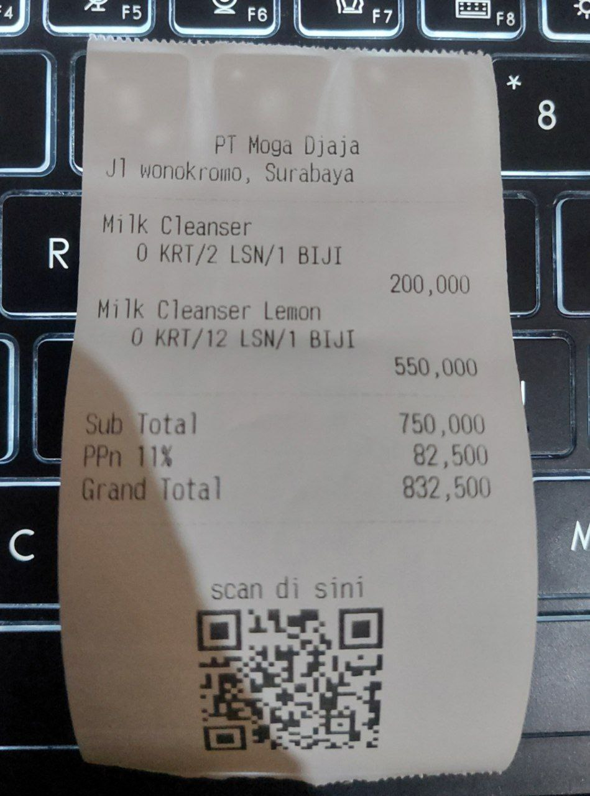

# @xyzsola/react-native-thermal-printer

Fork of `react-native-thermal-receipt-printer` with added support for column and Line printing.

[react-native-thermal-receipt-printer](https://github.com/Intechnity-com/react-native-thermal-printer)

## Install

```
npm i @xyzsola/react-native-thermal-printer
```

## Predefined tags

| Tags          | Description           |
|:-------------:|:---------------------:|
| Text          | Prints normal text    |
| NewLine       | Feed                  |
| QRCode        | Prints QR Code        |
| Line          | Prints Line           |

### Text

```xml
<Text align="center" fontWidth="1" fontHeight="1">Example text</Text>
```

Supported attributes:

| Attribute          | Description                                  |
|:------------------:|:--------------------------------------------:|
| font               | Font type, values: 0 - ? (Research required) |
| align              | Align text, values: left, center, right      |
| fontWidth          | Font width, values: 0 - 4                    |
| fontHeight         | Font height, values: 0 - 4                   |
| bold               | Bold, values: 0 - 1                          |
| base64             | If base64 encoded, values: 0 - 1             |
| indent             | Text indentation                             |

### Column Printing
It will print text with column format (left and right align at the same line)

```xml
<Text align="left">Left text|Right Text</Text>
```

### NewLine

```xml
<NewLine />
```

### Line

```xml
<Line lineChar='=' />
```

Supported attributes:

| Attribute             | Description                             |
|:---------------------:|:---------------------------------------:|
| lineChar              | Custom Line character                   |

### QRCode

```xml
<QRCode version='0' errorCorrectionLevel='3' magnification='6'>http://example.com</QRCode>
```

Supported attributes:

| Attribute             | Description                             |
|:---------------------:|:---------------------------------------:|
| version               | Code type, values: 0 - 19               |
| errorCorrectionLevel  | Error correction level, values: 0 - 3   |
| magnification         | Magnification, values: 1 - 8            |

## IPrintOptions

`IPrintOptions` is an interface that provides various options you can use for a print job when working with the `@xyzsola/react-native-thermal-printer` library.

### Options

#### beep

- **Type:** boolean

The `beep` option triggers the printer to make a beep sound when the print job is complete, if the printer supports this feature.
Default: false.

#### cut

- **Type:** boolean

The `cut` option will command the printer to automatically cut the paper after the print job, if the printer supports this feature.
Default: false.

#### tailingLine

- **Type:** boolean

The `tailingLine` option instructs the printer to print an extra blank line at the end of the print job.
Default: false.

#### encoding

- **Type:** string

The `encoding` option sets the character encoding for the print job. The default is UTF-8. You should set this to match the encoding of the data you're sending. Incorrect encoding could result in garbled output.

#### codepage

- **Type:** number

The `codepage` option specifies the code page that the printer should use to print the job. A code page is a table of characters that the printer uses to print text. Different code pages include different characters, so you should select the code page that includes all the characters you need.

## Example



## Usage

```typescript
import {
  IBLEPrinterIdentity,
  BLEPrinter,
} from "@xyzsola/react-native-thermal-printer";

await BLEPrinter.init();
const devices = await BLEPrinter.getDeviceList();
await BLEPrinter.connectPrinter(devices[0].innerMacAddress);

const options: IPrintOptions = {
  beep: true,
  cut: true,
  tailingLine: true,
  encoding: 'UTF-8',
  codepage: 0,
  colWidth: 32
};

BLEPrinter.print(`
  <Printout>
    <Text align='center' fontWidth='1' fontHeight='1'>PT Moga Djaja</Text>
    <NewLine />
    <Text align='left'>Jl wonokromo, Surabaya</Text>
    <NewLine />
    <Line />
    <Text align='left'>Milk Cleanser</Text>
    <NewLine />
    <Text align='left' indent='3'>0 KRT/2 LSN/1 BIJI</Text>
    <NewLine />
    <Text align='right'>200,000</Text>
    <NewLine />
    <Text align='left'>Milk Cleanser Lemon</Text>
    <NewLine />
    <Text align='left' indent='3'>0 KRT/12 LSN/1 BIJI</Text>
    <NewLine />
    <Text align='right'>550,000</Text>
    <NewLine />
    <Line />
    <Text align='left'>Sub Total|750,000</Text>
    <NewLine />
    <Text align='left'>PPn 11%|82,500</Text>
    <NewLine />
    <Text align='left'>Grand Total|832,500</Text>
    <Line />
    <NewLine />
    <Text align='center'>scan di sini</Text>
    <NewLine />
    <QRCode version='0' errorCorrectionLevel='3' magnification='6'>http://example.com</QRCode>
    <NewLine />
  </Printout>
`, options);
```

## Example

### USBPrinter (only supported on android)

```tsx
  import {
    USBPrinter,
    IUSBPrinterIdentity
  } from '@xyzsola/react-native-thermal-printer';

  ...

  type State = {
    printers: IUSBPrinterIdentity[];
    currentPrinter: IUSBPrinterIdentity;
  }

  ...

  async componentDidMount() {
    if (Platform.OS == "android") {
      await USBPrinter.init();
      var availablePrinters = await USBPrinter.getDeviceList();

      this.setState({
        printers: availablePrinters
      });
    }
  }

  async connectPrinter(printer: IUSBPrinterIdentity) {
    await USBPrinter.connectPrinter(printer.vendorId, printer.productId);

    this.setState({
      currentPrinter: printer
    });
  }

  print() {
    USBPrinter.print(`
<Printout>
  <Text align='center' fontWidth='1' fontHeight='1'>Example text</Text>
  <NewLine />
  <Text align='right' fontWidth='1' fontHeight='1' bold='0'>Second line</Text>
</Printout>`);
  }
  
  getPrinterDescription(printer: IUSBPrinterIdentity) {
    return `deviceName: ${printer.deviceName}, vendorId: ${printer.vendorId}, productId: ${printer.productId}`;
  }
  ...

  return (
    <View style={styles.container}>
      {
        this.state.printers.map(printer => (
          <TouchableOpacity key={printer.deviceName} onPress={() => this.connectPrinter(printer)}>
            <Text>{this.getPrinterDescription(printer)}</Text>
          </TouchableOpacity>
        ))
      }
      <Button title='Print' onPress={() => this.print()} />
    </View>
  )

  ...
```

### BLEPrinter

```tsx
  import {
    BLEPrinter,
    IBLEPrinterIdentity
  } from '@xyzsola/react-native-thermal-printer';

  ...

  type State = {
    printers: IBLEPrinterIdentity[];
    currentPrinter: IBLEPrinterIdentity;
  }

  ...

  async componentDidMount() {
    await BLEPrinter.init();
    var availablePrinters = await BLEPrinter.getDeviceList();

    this.setState({
      printers: availablePrinters
    });
  }

  async connectPrinter(printer: IBLEPrinterIdentity) {
    await BLEPrinter.connectPrinter(printer.innerMacAddress);

    this.setState({
      currentPrinter: printer
    });
  }

  print() {
    BLEPrinter.print(`
<Printout>
  <Text align='center' fontWidth='1' fontHeight='1'>Example text</Text>
  <NewLine />
  <Text align='right' fontWidth='1' fontHeight='1' bold='0'>Second line</Text>
</Printout>`);
  }

  getPrinterDescription(printer: IBLEPrinterIdentity) {
    return `deviceName: ${printer.deviceName}, innerMacAddress: ${printer.innerMacAddress}`;
  }

  ...

  return (
    <View style={styles.container}>
      {
        this.state.printers.map(printer => (
          <TouchableOpacity key={printer.deviceName} onPress={() => this.connectPrinter(printer)}>
            <Text>{this.getPrinterDescription(printer)}</Text>
          </TouchableOpacity>
        ))
      }
      <Button title='Print' onPress={() => this.print()} />
    </View>
  )

  ...
```

### NetPrinter

_Note:_ getDeviceList does support scanning in local network, but is not recommended

```tsx
  import {
    NetPrinter,
    INetPrinterIdentity
  } from '@xyzsola/react-native-thermal-printer';

  ...

  type State = {
    printers: INetPrinterIdentity[];
    currentPrinter: INetPrinterIdentity;
  }

  ...

  async componentDidMount() {
    await NetPrinter.init();
    var availablePrinters: INetPrinterIdentity[] = [{ deviceName: 'test', host: '192.168.1.1', port: 9100 }];

    this.setState({
      printers: availablePrinters
    });
  }

  async connectPrinter(printer: INetPrinterIdentity) {
    printer = await NetPrinter.connectPrinter(printer.host, printer.port);

    this.setState({
      currentPrinter: printer
    });
  }

  print() {
    NetPrinter.print(`
      <Printout>
        <Text align='center' fontWidth='1' fontHeight='1'>Example text</Text>
        <NewLine />
        <Text align='right' fontWidth='1' fontHeight='1' bold='0'>Second line</Text>
      </Printout>
    `);
  }

  getPrinterDescription(printer: INetPrinterIdentity) {
    return `deviceName: ${printer.deviceName}, host: ${printer.host}, port: ${printer.port}`;
  }

  ...

  return (
    <View style={styles.container}>
      {
        this.state.printers.map(printer => (
          <TouchableOpacity key={printer.deviceName} onPress={() => this.connectPrinter(printer)}>
            <Text>{this.getPrinterDescription(printer)}</Text>
          </TouchableOpacity>
        ))
      }
      <Button title='Print' onPress={() => this.print()} />
    </View>
  )

  ...

```
